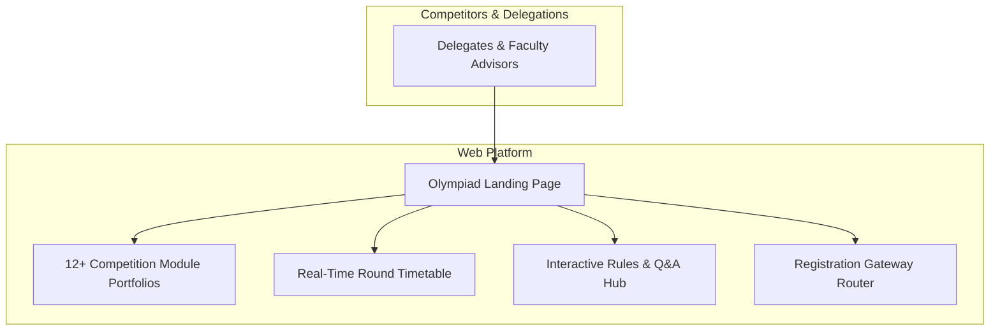

# SCINNOVA IX — Science Olympiad Platform & Showcase

Official web portal engineered for **SCINNOVA IX**, the annual inter-school and collegiate Science Olympiad hosted by Cedar College, Karachi.

---

## Role & Recognition

* **Role:** Lead Web Architect & Developer
* **Patron:** Sir Rayyan Dawood (Patron of Scinnova)
* **Scope:** Conceived and engineered the complete event web platform showcasing scientific competition modules, rulebooks, event schedules, Q&A repositories, and external registration gateway links.
* **Recognition:** Awarded an **Honorary Shield for Outstanding Contribution as Web Developer** by Olympiad Patron Sir Rayyan Dawood.

### Recognition Shield

| Front View | Angled View |
| :---: | :---: |
|  |  |

*Inscription:*  
> **"SCINNOVA IX — Presented to Rayyan Muhammad in recognition of your outstanding contribution as Web Developer at SCINNOVA IX. Your passion, commitment, and hard work have made this event truly memorable."**  
> *Patron: Rayyan Dawood*

---

## Architecture Pipeline

---

## Core Technical Highlights

* **Module Information Engine:** Dynamic breakdown of scientific challenges across Physics, Chemistry, Biology, Robotics, and Astronomy with downloadable guideline documents.
* **Rules & Q&A Knowledge Base:** Structured query portal answering delegate queries regarding team formats, judging criteria, and lab safety protocols.
* **Event Dispatching:** Managed incoming traffic surges during city-wide school registration drives, routing candidates to verified submission channels.
* **Responsive Viewports:** Multi-device layout optimized for mobile delegates checking match schedules and room assignments on-site during competition days.

---

## Tech Stack

* **Frontend:** Modern HTML5, CSS3, JavaScript
* **Styling:** Responsive Grid & Flexbox, Tailwind CSS
* **Hosting:** High-availability CDN deployment
