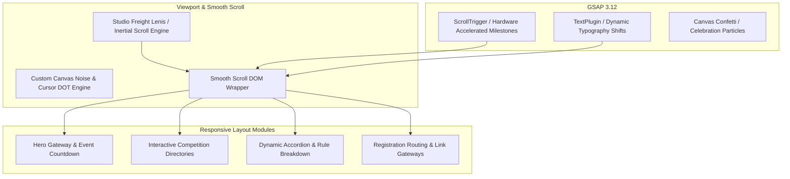

# 🏆 SCINNOVA IX — Official Science Olympiad Web Platform

Official digital gateway and interactive platform engineered for **SCINNOVA IX**—Cedar College's 9th International Inter-School Science Olympiad held in Karachi, Pakistan. 

Awarded the **Honorary Award Shield** and **Certificate of Recognition** on stage by Event Patron **Sir Rayyan Dawood** for sole technical architecture and design execution.

---

## 🎖️ Institutional Commendation & Recognition

  
  
<em>Honorary Award Shield presented by Patron Sir Rayyan Dawood on stage during the SCINNOVA IX Grand Closing Ceremony</em>

   
  
  
<em>Official Cedar College Certificate of Recognition for Technical Architecture</em>

---

## 🏛️ Platform Mission & Event Overview

SCINNOVA IX is one of Pakistan's premier high school science competitions, convening hundreds of delegates across competing schools. The event required an immersive, modern web experience to showcase complex tournament modules, rules, schedule timelines, and FAQs.

### Competitive STEM Modules Featured:
1. **Arcanum (Chemical Sciences):** High-stakes laboratory puzzles and qualitative analysis.
2. **Asclepius (Biological & Medical Sciences):** Clinical diagnostic rounds and emergency medicine simulations.
3. **Redshift (Astrophysics & Cosmology):** Orbital mechanics, stellar evolution, and deep-space physics.
4. **Ptolemy's Puzzle (Mathematics & Logic):** Combinatorics, number theory, and algorithmic problem-solving.

---

## 🛠️ Frontend Motion Architecture & Performance

### Engineering Highlights:
* **Zero-Framework Vanilla JS Engine:** Built with semantic HTML5, modular CSS3, and modern ES6+ to avoid framework bundle bloat and ensure instantaneous initial contentful paint (FCP < 0.8s).
* **Inertial Smooth Scrolling (`Lenis`):** Normalized scroll mechanics across Mac, Windows, iOS, and Android to guarantee consistent interaction physics.
* **Scroll-Driven Milestones (`GSAP ScrollTrigger`):** Pinned sections and scrubbed timeline animations that reveal module details as delegates navigate through the site.
* **120Hz Mobile Frame-Rate Tuning:** Converted layout animations to use GPU-accelerated CSS `transform` and `opacity` properties, maintaining a sustained 60+ FPS across low-to-mid range mobile viewports.

---

## 📁 Repository Contents

* `Scinnova IX Photo.jpeg`: High-resolution photograph of the Honorary Award Shield.
* `Scinnova IX.png`: High-resolution scan of the Cedar College Certificate of Recognition.
* `README.md`: Event specifications, motion architecture, and engineering review.

---

## 📄 License
Documented and published under the [MIT License](LICENSE).
