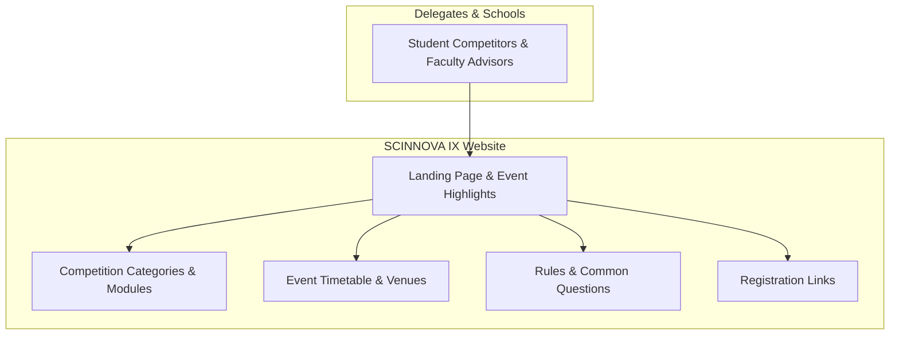

# SCINNOVA IX — Science Olympiad Web Platform

Official web portal engineered for **SCINNOVA IX**, the annual inter-school Science Olympiad hosted by Cedar College, Karachi.

---

## Role & Recognition

* **Role:** Sole Web Developer & Designer (from initial UI design to final deployment)
* **Patron:** Sir Rayyan Dawood (Patron of Scinnova)
* **Scope:** Independently built the entire event website showcasing competition modules, competition rulebooks, event schedules, FAQs, and delegate registration links.
* **Recognition:** Awarded the **Honorary Shield for Outstanding Contribution as Web Developer** by Olympiad Patron Sir Rayyan Dawood.

### Recognition Shield

| Front View | Angled View |
| :---: | :---: |
|  |  |

*Inscription:*  
> **"SCINNOVA IX — Presented to Rayyan Muhammad in recognition of your outstanding contribution as Web Developer at SCINNOVA IX. Your passion, commitment, and hard work have made this event truly memorable."**  
> *Patron: Rayyan Dawood*

---

## Site Structure

---

## Technical Highlights

* **Performance & Motion:** Built with vanilla JavaScript, GSAP ScrollTrigger, and Lenis smooth scrolling for smooth transitions without heavy framework overhead.
* **Module Showcase:** Structured directories detailing STEM competition categories (*Arcanum*, *Asclepius*, *Redshift*, *Ptolemy's Puzzle*) with round criteria and team parameters.
* **Responsive Layout:** Designed for mobile and desktop screens to ensure competing delegates could check schedules and announcements live during the tournament.

---

## Tech Stack

* **Frontend:** Semantic HTML5, Modular CSS3, Vanilla JavaScript (ES6+)
* **Animation & Scrolling:** GSAP (ScrollTrigger, TextPlugin), Studio Freight Lenis
* **Assets:** WebP image optimization

---

## Notice

Event logos, participant imagery, and Cedar College Olympiad assets are published for portfolio documentation.
